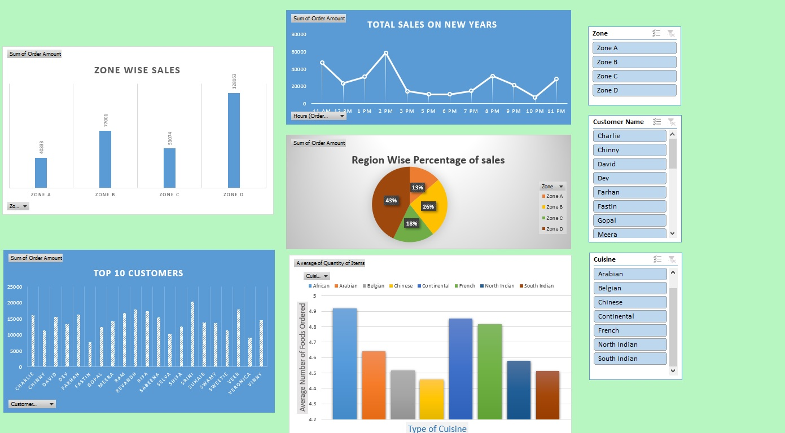

# Food_Orders_Dashboard

This repository contains an excel project that analyzes and visualizes food orders data on New Year's Day using Excel. The analysis includes trends and patterns in the data, as well as the creation of interactive charts and graphs to help understand and communicate the insights derived from the data all presented in a dashboard.

Description:

The dataset in file E-Commerce Dashboard Orders_Dashboard.xlsx contains orders placed for different zones and cuisines on New Year's Day which is taken from 'Orders.xlsx'.
It also contain another excel ' Restaurant.xlsx' from which each restaurant ID has name, zone, cuisine and type of restaurant.

The final dataset is prepared by using VLOOKUP function and static valued dataset is created which can be viewed in Orders_Dashboard.xlsx

The following are the features in the dataset:
* Order ID
* Customer Name
* Restaurant ID
* Order Data
* Order amount
* Payment Mode
* Delivery Time Taken
* Customer ratings - Food and Delivery
* Restaurant Name 
* Zone
* Cuisine
* Category/Type 

The following project tasks are required to be performed in Excel:

* Utilising both orders.xlsx and restaurant.xlsx to create static valued dataset
* Prepare a pivot table to visualize Total order amount in different regions.
* Prepare a pivot table to visualize Region wise pecentage order amount
* prepare a pivot table to visualize Top 10 customers by Ordered Amount.
* prepare a pivot table to visualize Total sales timeline on New Year's Day
* prepare a pivot table to visualise the different type of cuisines by Orders
* Create slicers with respect to zones, Customers and cuisines to view order amount distribution.
